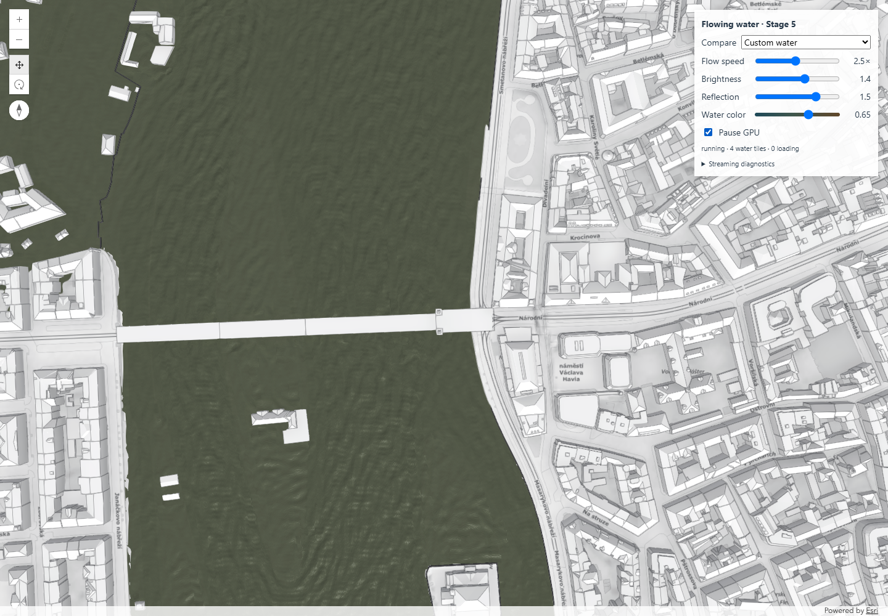

# flood-water-renderer

Add tiled, locally flow-driven water to an **existing ArcGIS SceneView**. The
module fetches bounded hydraulic tiles, maintains a RAM/GPU cache and animates
procedural water normals using the local velocity. It owns no SceneView, map,
source layers, camera or UI. No water textures or pre-generated water tiles need
to be deployed.

Version **0.1.0**, pre-1.0 API; not published to npm. The repository remains
**UNLICENSED** (see [license status](LICENSE)). `private: true` prevents accidental
npm publication; it does not determine the repository's GitHub visibility.



The image is a historical demo capture using external ArcGIS/Prague services.
The renderer visualizes supplied flood data; it does not simulate flood propagation.

## Documentation

- [Illustrated principles and technical implementation (Czech PDF, 14 pages)](docs/renderer-guide-cs.pdf)
- [Architecture and ownership](docs/architecture.md)
- [Normalized data contract](docs/data-contract.md)
- [Static demo deployment](docs/deployment.md)
- [Development and verification](CONTRIBUTING.md)
- [Changelog](CHANGELOG.md) and [GitHub publication handoff](docs/publication.md)

## Requirements

- Browser application with WebGL2 and an active, visible **global SceneView**.
  Tested in Chrome on Windows. SSR and workers are not supported.
- **`@arcgis/core` exactly 5.1.26**, the only tested SDK version. It is an external
  peer dependency: the host supplies one copy. RenderNode remains an experimental
  ArcGIS API; compatibility with other SDK versions is not claimed.
- For repository builds: Node.js ≥22.12 (tested 24.21), npm and network access to
  your configured ArcGIS services. Browser integration tests additionally require
  installed Google Chrome.

## Build and run the examples

```sh
npm ci
npm run build
npm run example
```

`npm install` is also supported; `npm ci` reproduces the committed lockfile.
The opened root page is the Prague comparison demo. Open
`/examples/minimal/` on the same server for the UI-free library integration.
Both examples import **`dist/flood-water-renderer.js`**, never library internals.
Rebuild the library after editing its source.

```sh
npm run build:lib       # dist/: reusable ESM JS and .d.ts only
npm run build:examples  # demo-dist/: separate demonstration applications
npm test               # grid/cache/API/package checks; build library first
npm run test:types     # public declaration/consumer type check
npm run test:browser   # builds should already exist; launches Chrome + test server
npm run test:prague    # live Prague UI checks; requires Chrome and service access
npm run check          # build + Node tests + public type checks (used by CI)
```

No global test packages or machine-specific paths are needed. The library is
browser ESM for an npm-aware bundler, not a CDN script with an embedded SDK.
GLSL sources are embedded in the JS; no GLSL loader configuration is needed in
the host. The host continues to configure normal ArcGIS CSS, SDK assets, licensing,
authentication and any proxy settings as it already does.

To hand over a local package:

```sh
npm run build:lib
npm pack
# In the receiving application's directory:
npm install /path/to/flood-water-renderer-0.1.0.tgz @arcgis/core@5.1.26
```

The name is a local placeholder, not a claim of npm name availability. Do not
publish this package. `private: true` prevents accidental publication.

## Repository layout

```text
src/public/       public API, declarations and lifecycle
src/data/         ArcGIS adapter and normalized tile data
src/water/        grid, camera selection and tile cache
src/render/       RenderNode, GPU resources and GLSL
examples/         Prague demo and minimal host integration
tests/, scripts/  unit, type, browser and package verification
docs/             guides and historical rendering evidence
development/      historical debugging snapshots, not runtime dependencies
dist/             generated reusable library (ignored)
demo-dist/        generated static website (ignored)
```

CI builds and checks the project on Windows and Ubuntu using Node 24. Browser
tests are separate because they require live ArcGIS services and WebGL. See
[CONTRIBUTING.md](CONTRIBUTING.md) for commands and evidence handling.

## Quick start with existing objects

```js
import { FloodWaterRenderer, ArcGISFloodAdapter } from 'flood-water-renderer';

// view: existing SceneView
// flowLayer: existing ImageryTileLayer
// footprintLayer: existing polygon FeatureLayer
// longitude/latitude: fixed geographic origin for this scenario, in degrees
const adapter = new ArcGISFloodAdapter({
  flowLayer,
  footprintLayer,
  ground: view.map.ground,
  id: 'my-flood-scenario-v1',
  flowRepresentation: 'vector-magdir',
  directionConvention: 'flow-from',
  coordinates: { origin: [longitude, latitude] },
  magnitudeReference: 30 // choose a representative upper magnitude, shared globally
});

const water = new FloodWaterRenderer({ view, adapter });
const offError = water.on('error', error => {
  console.error(error.code, error.message); // error.cause retains underlying details
});
const offReady = water.on('ready', status => {
  console.log('First water drawn', status.tiles.active);
});
await water.start();
water.setParameters({ flowSpeed: 2.5, brightness: 1.4, reflection: 1.5, waterColor: 0.65 });

// On application cleanup, BEFORE destroying your SceneView:
offError();
offReady();
water.destroy(); // view and layers remain owned by the host and usable
```

`start()` validates sources and initializes the GPU program. It does **not** wait
for every tile. Listen for `ready` or read `getStatus().ready` for the first usable
water draw. An area without water may never emit `ready`.

The library never changes original layer visibility. If an existing Esri water
layer overlaps the new surface, **the host must hide/restore it**. For example:

```js
const originalVisible = footprintLayer.visible;
await water.start();
footprintLayer.visible = false; // still queryable by the adapter
// Later:
water.destroy();
footprintLayer.visible = originalVisible;
```

Manage a FlowRenderer reference layer the same way if desired. The optional panel
in `examples/prague/controls.js` demonstrates comparison, sliders, pause and
visibility restoration using only the public API. It is not part of the package;
the renderer needs **zero library CSS or UI**.

## Required input data

**Flow:** existing `ImageryTileLayer`, WGS84/EPSG:4326, two-band Vector-MagDir:
band 0 magnitude, band 1 direction in degrees, with PixelBlock validity/band masks.
Current supported interpretation is explicitly `flow-from`: east=M·sin(D),
north=M·cos(D), as established against ArcGIS FlowRenderer. Do not infer a
meteorological 180° reversal from the name. The adapter rejects other conventions
and representations. A FlowRenderer is not required on the source object; if
present, its convention must agree. Nonfinite/negative values are excluded.

**Footprint:** queryable polygon `FeatureLayer`, including holes. Its coverage
controls water existence independently of velocity NoData. Water without usable
velocity remains calm/stationary rather than disappearing or inventing fast flow.

**Vertical surface:** the **same Ground object used by the host view**, with one
active elevation layer. Ground.queryElevation positions the static mesh, with a
0.20 m rendering tolerance by default. This surface is **not water depth**.
Compatible source coverage/view extents must use WGS84 or Web Mercator. The tested
rendering frame is a global SceneView; local viewing mode is not supported.

`coordinates.origin` is a fixed scenario frame, not the current camera center.
`magnitudeReference` controls subtle normal activity normalization; it does not
convert physical units or normalize uploaded velocities. Confirm source units and
direction convention with the data provider. The example's physical units are
undocumented; animation speed is visual, not calibrated hydraulic travel time.

## Parameters

`setParameters(partial)` validates the entire update before applying anything.
Unknown names, nonfinite values and out-of-range values throw `INVALID_PARAMETER`.
`getParameters()` returns a copy. Settings are independent between instances.
All updates affect uniforms/the common clock only; they do not fetch data, rebuild
geometry or upload textures.

| Parameter | Range | Default | Meaning |
|---|---|---:|---|
| `flowSpeed` | 0.25–5 | 1 | Multiplier of the established 0.12 visual advection baseline |
| `brightness` | 0.5–2 | 1 | Exposure of the complete shaded result |
| `reflection` | 0–2 | 1 | Analytic sky/Fresnel/specular strength |
| `waterColor` | 0–1 | 0.45 | Blue-green → green-gray → muddy brown body color, before lighting |
| `opacity` | 0–1 | 0.96 | Surface alpha |
| `paused` | boolean | false | Freeze animation; camera streaming and visual updates still work |

## Lifecycle and ownership

- **Constructor:** validates configuration/parameters; no network, watches or GPU
  resources. Supply one adapter per active renderer.
- **`start(): Promise<void>`:** idempotent while running. Calls made while starting
  share the same pending promise. Resolves after source validation and first GPU
  program setup. Requires a rendering/visible view. Initialization failures reject
  with `FloodWaterError` and also emit `error`.
- **`stop(): void`:** cancels current acquisition, removes watches and the custom
  node, releases all tile/GPU resources, and enters `stopped`. It deliberately
  **does not retain cache**. Parameters survive; a later start creates a clean run
  with a new animation clock. An interrupted start rejects with `ABORTED`.
- **`destroy(): void`:** permanent and idempotent. Performs stop cleanup, clears
  event listeners and host-view/adapter references. Never destroys the host view,
  layers or ground. Later start/parameter/event registration fails with
  `RENDERER_DESTROYED`; status/parameter snapshots remain readable.

Only one running/starting renderer can attach to a SceneView. A second start
rejects `VIEW_IN_USE`. A shared active adapter similarly rejects `ADAPTER_IN_USE`.
A stopped renderer releases these reservations. Destroy water before destroying
its view; a host-view destruction watch also provides defensive cleanup.

## Status and events

```js
const status = water.getStatus();
// { state, ready, scenarioId, limited, tiles, memory, statistics, lastError }
const off = water.on('statuschange', status => updateYourLoadingIndicator(status));
// Later: off();
```

States: `idle`, `starting`, `running`, `stopped`, `error`, `destroyed`.
`tiles` contains required, ready, loading, cached, failed, empty and active counts.
Ready/failed counts include cache entries, not only visible ones. `memory` reports
approximate retained CPU array and GPU payload bytes, excluding ArcGIS overhead.
`statistics` reports request counts, hits/evictions/cancellations, average acquisition
times, upload/program counts and custom CPU submission time. Snapshots contain no
mutable internal records or resource handles.

Events are `ready` (first water draw once per run), `statuschange` (material
lifecycle/loading/residency/parameter changes, not each frame) and `error`
(`FloodWaterError`: `code`, `message`, `fatal`, optional `tileId`, underlying `cause`).
Tile errors are isolated and acquisition retries up to three attempts. A fatal
rendering error releases the run and enters `error`. The host decides how to
present errors and restore its own comparison layers; the library does not dump
large ArcGIS objects to the console.

Useful error codes include `UNSUPPORTED_FLOW_LAYER`, `FLOW_UNAVAILABLE`,
`UNSUPPORTED_FLOW_REPRESENTATION`, `MISSING_BANDS`, `INVALID_DIRECTION_CONVENTION`,
`UNSUPPORTED_SPATIAL_REFERENCE`, `FOOTPRINT_UNAVAILABLE`, `ELEVATION_UNAVAILABLE`,
`VELOCITY_QUERY_FAILED`, `ELEVATION_QUERY_FAILED`, `GPU_INITIALIZATION_FAILED`,
`GPU_TILE_FAILED`, `TILE_MEMORY_BUDGET`, `INVALID_ADAPTER`, `INITIALIZATION_FAILED`,
`INVALID_CONFIGURATION`, `INVALID_PARAMETER`, `VIEW_IN_USE`, `ADAPTER_IN_USE`,
`ABORTED`, and `RENDERER_DESTROYED`. Messages are concise; inspect `cause` for details.

## Performance and limits

Defaults preserve the proven fixed grid: 512 m tiles, 384² velocity pixels plus a
2-pixel border, 768² polygon mask plus border, 192² mesh cells, two concurrent tile
preparations and one-tile preload. A water tile is about 4 MiB CPU plus 4 MiB GPU.
Default cache caps are 96 records and 160 MiB array payload (approximately another
160 MiB GPU at full occupancy), with 30-second idle eviction. Shared time/global
coordinates prevent independent tile phases. Steady animation does not refetch or
re-upload data. SDK-managed network caches/assets remain the host's concern.

Advanced residency overrides use constructor `options`, for example
`{maxBytes:128*1024*1024,maxRequired:24,maxEntries:64}`. Grid/acquisition overrides
belong to adapter `tileScheme` and `surface`; see declarations and the data contract.
Changing them requires a new run/adapter, not a visual parameter update.

No distance LOD: wide/horizon views cap at 36 required tiles and set `limited:true`.
Zoom closer for full detailed coverage. Rapid long jumps can expose temporary
loading gaps. Minor shoreline antialias/elevation fringes remain possible. The
shared local east/north approximation is intended for a regional scenario, not
continental rendering. Water is visually plausible, not a physical fluid solver.
No depth reconstruction, foam, geometry displacement, refraction or actual scene
reflections are implemented. General SDK offscreen screenshot compatibility and
full WebGL context-loss recovery are not certified; presented Chrome frames were
used for verification.

## Another scenario

Publish compatible flow, flood polygons and a vertical surface. Supply those
existing layer/Ground objects, a scenario ID/revision, fixed geographic origin,
explicit interpretation metadata and magnitude reference. No renderer source or
shader edits are needed. No custom preprocessing or persistent water tiles.

Alternatively, `createFloodWaterFromScenario({view,scenario,parameters,options})`
resolves explicit source roles in **the host's existing map**, constructs the
adapter/renderer and starts it. It does not create/load a different WebScene or
change visibility. Roles use service `url` or WebScene `Layer.id` (`layerId`, not
the numeric service sublayer). `FloodScenario` is fully typed; the Prague example
shows this convenience path. On switching sources, destroy the old renderer and
attach a new configured adapter after the host updates its map.

For other future encodings, implement the normalized adapter boundary; the water
shader continues to consume components, coverage and surface geometry. See
[architecture](docs/architecture.md) and [data contract](docs/data-contract.md).
Engineering history remains in the repository's STAGE1–STAGE5 reports and docs
captures; none is required to integrate or included in the production JS.
